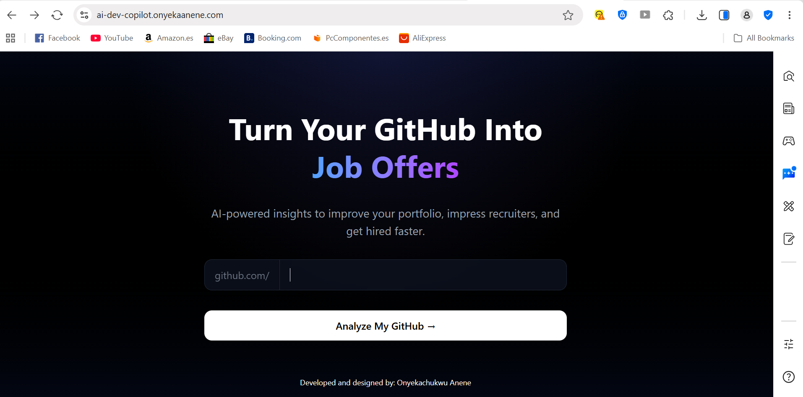

# 🚀 AI Dev Copilot — GitHub Portfolio Analyzer

> Meet Zeva 🤖, an AI-powered developer tool that analyzes your GitHub profile and gives actionable feedback to help you improve your portfolio and get hired faster.

 Coming Soon  
**📂 Repo:** https://github.com/onyekaanene/ai-dev-copilot  

**🔗 Live Link:** [ai-dev-copilot.onyekaanene.com](https://ai-dev-copilot.onyekaanene.com) &nbsp;|&nbsp; **📂 Repo:** [github.com/onyekaanene/ai-dev-copilot](https://github.com/onyekaanene/ai-dev-copilot) 

---

## 🚀 Why I Built This

Many many developers struggle to understand why their GitHub isn’t converting into job offers. AI Dev Copilot uses AI to analyze your repositories and give structured feedback like a senior engineer reviewing your work.

---

## ✨ Features

| Feature               | Description                                                       |
| --------------------- | ----------------------------------------------------------------- |
| 🔍 GitHub Analysis    | Enter a username and fetch real repositories instantly            |
| 🤖 AI Feedback        | Claude AI reviews your repos and gives structured hiring feedback |
| 📊 Portfolio Insights | Highlights strengths, weaknesses, and missing elements            |
| 📦 Repo Breakdown     | Clean UI showing stars, descriptions, and tech stack              |
| ⚡ Fast & Lightweight  | Server-side rendering for performance                             |
| 🎯 Job-Focused        | Built specifically to improve employability                       |

---

## 📸 Screenshots



---

## 🎬 App Walkthrough

### Landing Page — Simple & Focused
Enter your GitHub username with a clean, guided input (github.com/username) and trigger analysis instantly.

### Analysis Page — AI + Data
Fetches your top repositories
Displays structured repo cards
Sends data to AI (Claude)
Returns:
- Overall rating
- Weaknesses
- Improvements
- Hiring readiness feedback

---

## 🛠️ Tech Stack

```
Frontend       Next.js 16 (App Router) + TypeScript
Styling        Tailwind CSS (v4)
Backend        Next.js API Routes
AI             Anthropic claude-haiku-4-5
Data Source    GitHub REST API
Deployment     Vercel
```

### 🧠 Architecture Decisions
- **Next.js App Router** — enables server components, API routes, and clean file-based routing in one framework.
- **Server-Side Rendering (SSR)** — the /analyze page runs on the server for better performance and avoids client-side hydration issues.
- **API Route Separation** — GitHub fetching and AI analysis are handled in separate backend routes for scalability.
- **Anthropic (Claude) over OpenAI** — chosen for reliability and structured responses in this use case.
- **Tailwind CSS v4** — modern utility-first styling with minimal configuration.

---


## 📁 Project Structure

```
ai-dev-copilot/
├── app/
│   ├── page.tsx              # Landing page
│   ├── analyze/page.tsx      # Analysis page (server-side)
│   ├── api/
│   │   ├── github/route.ts   # Fetch GitHub repos
│   │   └── analyze/route.ts  # AI analysis (Claude)
│
├── public/
│   └── screenshots/          # App screenshots
│
├── app/globals.css           # Tailwind styles
├── app/layout.tsx            # Root layout
├── .env.local                # Environment variables

```
---

## 🗺️ Roadmap

### ✅ Completed
- [x] GitHub username input and routing
- [x] Fetch repositories via GitHub API
- [x] Clean repo card UI
- [x] AI analysis using Claude
- [x] Server-side rendering for /analyze
- [x] Production-ready build
- [x] Tailwind CSS premium UI

### 🔜 Coming Soon
- [ ]Per-repo AI suggestions (“Improve this repo”)
- [ ]Portfolio score visualization (e.g., 7.5/10)
- [ ]Save and share analysis reports
- [ ]Authentication (Supabase)
- [ ]Recruiter mode (view candidate profiles)

---

## 🙏 Acknowledgements


---

## 🏃 Running Locally

### 1. Clone the repo
```bash
git clone https://github.com/onyekaanene/ai-dev-copilot.git  
cd ai-dev-copilot  
npm install  
```

### 2. Set up environment variables
Create `.env.local`:
```
ANTHROPIC_API_KEY=your_key  
NEXT_PUBLIC_BASE_URL=http://localhost:3000  
```

### 3. Run the app
```bash
npm run dev  
```

Open [http://localhost:3000](http://localhost:3000)

---

## 🚢 Deployment

The app is optimized for deployment on **Vercel.**

Steps:
[1] Push to GitHub
[2] Import project into Vercel
[3] Add environment variables:
- ANTHROPIC_API_KEY
- NEXT_PUBLIC_BASE_URL (your domain)

---

## 👨‍💻 Author

**Built with ❤️ by Onyekachukwu Anene** — Software Engineer (Applied AI & SaaS) | Building AI-powered web & mobile products. Available for freelance and full-time opportunities. 

[](https://github.com/onyekaanene)
[](https://www.linkedin.com/in/onyekachukwu-anene)
[](https://www.onyekaanene.com/projects)

---

## 📄 License

MIT — feel free to fork, use, and build on this.
